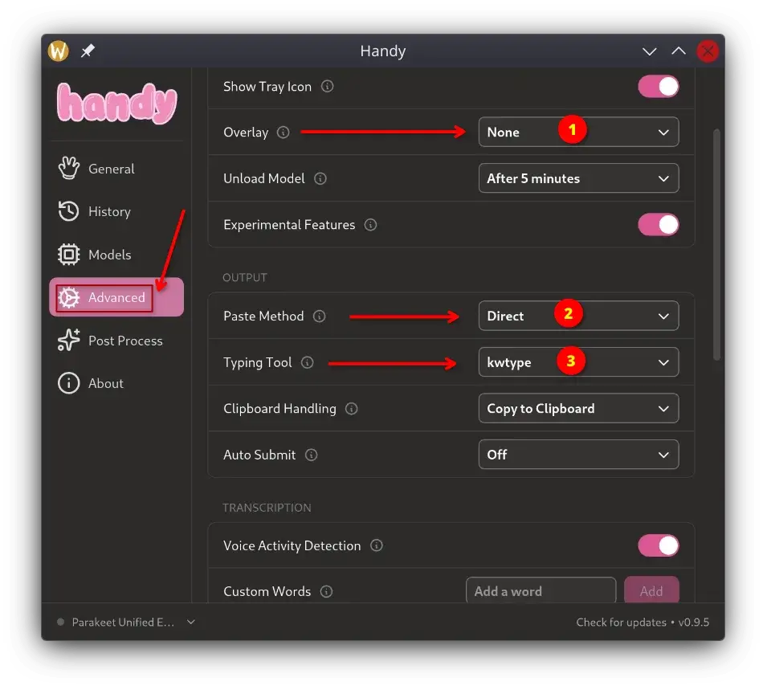

# Handy KDE Wayland Fix for Fedora

This is a small installer for `KWtype` on Fedora KDE Wayland. Tested on Fedora KDE Plasma (Wayland) 44.

I was having problem with [Handy](https://handy.computer/) where the transcription was working fine and the text was going into clipboard, but it was not writing the text into the active editor or browser textbox.

Normal clipboard paste was working manually, so the problem was not the transcription itself or the Handy engine.

The problem was the input method under KDE Wayland. Wayland has a much more restrictive desktop security for applications to allow pasting or interact with desktop or typing systems.

In this case:

- `wtype` is not really useful here because KWin does not support the needed Wayland virtual keyboard protocol.

- `ydotool` can work, but it needs `ydotoold`, `/dev/uinput`, permissions and some extra setup.

- `KWtype` works better for KDE because it uses KWin Fake Input directly and natively Wayland.

After installing KWtype, Handy was able to use Direct paste and I confirmed it working in:

* browser text boxes
* Kate
* KWrite
* VSCode

Handy also showed:

```text
Using kwtype for direct text input on KDE Wayland
```

## Install

⚠️ Run this as your normal desktop user.

⚠️ Do not use `sudo bash`. Just use the following command:

```bash
curl -fsSL https://raw.githubusercontent.com/ruhanirabin/handy-fedora-kde-wayland-fix/main/install.sh | bash
```

The script will ask for sudo only when it needs to install Fedora packages or create the log directory.

It installs KWtype to:

```text
~/.local/bin/kwtype
```

## Handy Settings

In Handy use (see image):

1. Set overlay to `none`
2. Set paste method to `direct`
3. Set typing tool to `kwtype`



## Restart Handy

On KDE Wayland, Handy should detect KWtype automatically when it is available. **Make sure you restarted Handy after you have installed kwype.**

You can check Handy logs and should see something like:

```text
Using kwtype for direct text input on KDE Wayland
```

## Test KWtype

You can test KWtype without Handy first.

Run:

```bash
sleep 3; ~/.local/bin/kwtype "KWtype works on KDE Wayland"
```

After running the command, click inside Kate, KWrite, browser textbox or another editor before the 3 seconds finish.

The text should be written into the active application.

KWin may ask for Fake Input permission the first time.

## Manual Install

If you do not want to use the installer script, these are the manual commands.

Install the Fedora build packages:

```bash
sudo dnf install \
    git \
    gcc-c++ \
    meson \
    ninja-build \
    pkgconf-pkg-config \
    qt6-qtbase-devel \
    kwayland-devel \
    libxkbcommon-devel \
    wayland-devel
```

Clone KWtype:

```bash
git clone https://github.com/Sporif/KWtype.git
cd KWtype
```

Configure the build:

```bash
meson setup \
    --buildtype=release \
    --prefix="$HOME/.local" \
    build
```

Compile:

```bash
meson compile -C build
```

Install:

```bash
meson install -C build
```

Check that it is installed:

```bash
ls -l ~/.local/bin/kwtype
```

Then test:

```bash
sleep 3; ~/.local/bin/kwtype "KWtype works on KDE Wayland"
```

If this works, Handy Direct paste should be able to use KWtype on KDE Wayland.
